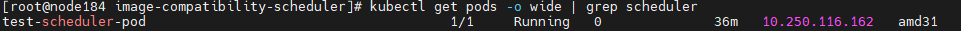
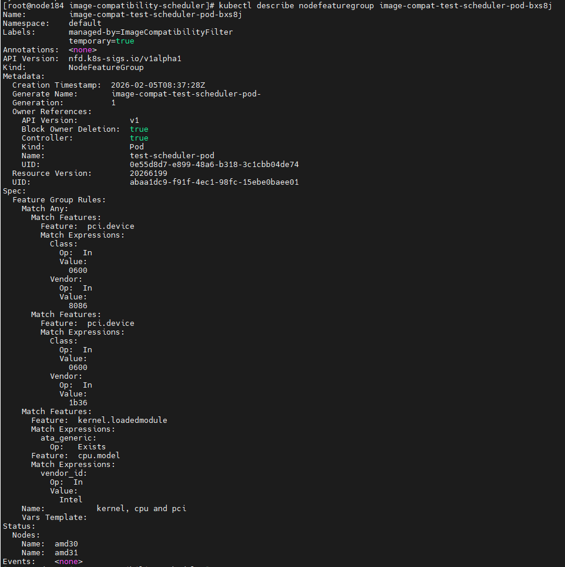

# Custom Scheduler with Image Compatibility Plugin

A Kubernetes custom scheduler that filters nodes based on image compatibility using Node Feature Discovery (NFD).

## Features

- **Image Compatibility Filtering**: Filters nodes based on container image compatibility using NodeFeatureGroup CRs
- **Dynamic Namespace Discovery**: Automatically discovers nfd-master namespace
- **TTL-based Cleanup**: Temporary NodeFeatureGroup CRs are automatically cleaned up via OwnerReference

## Prerequisites

- Kubernetes cluster (v1.20+)
- Node Feature Discovery (NFD) installed
- Go 1.25+
- Docker (for building images)

## Building

### Build Binary

```bash
make build
```

### Build Docker Image

```bash
make docker-build
```

Or with custom registry:

```bash
REGISTRY=my-registry.io IMAGE_NAME=my-scheduler make docker-build
```

## Deployment

### Quick Start

```bash
# 1. Build Docker image
make docker-build

# 2. Push image (if using remote registry)
make docker-push

# 3. Deploy to Kubernetes
make deploy
```
For detailed deployment steps, refer to [DEPLOYMENT.md](docs/DEPLOYMENT.md)

For quick start guide, refer to [QUICKSTART.md](QUICKSTART.md)

### Manual Deployment

```bash
kubectl apply -k deploy/
```

### Undeploy

```bash
make undeploy
```

## Plugin Details

### ImageCompatibilityFilter Plugin

The plugin implements the Filter extension point and:

1. Creates temporary NodeFeatureGroup CRs for each container image in the Pod
2. Runs nfd-master to update NodeFeatureGroup status with matching nodes
3. Computes the intersection of compatible nodes across all images
4. Filters nodes that are not compatible with all images

### Namespace Discovery

The plugin automatically discovers the nfd-master namespace at runtime:

1. **Priority Search**: First searches in common namespaces where NFD is typically installed:
   - `node-feature-discovery`
   - `kube-system`
   - `default`

2. **Fallback Search**: If not found in common namespaces, searches across all namespaces for pods with the NFD master label selector:
   - Label: `app.kubernetes.io/name=node-feature-discovery,role=master`

3. **Lazy Discovery**: If namespace discovery fails during plugin initialization, it will retry on first use when a Pod needs to be scheduled.

This dynamic approach ensures compatibility with different NFD installation configurations without requiring manual configuration.

## Verification

### Manual Verification

1. **Check scheduler status**:
   ```bash
   kubectl get pods -n custom-scheduler
   kubectl logs -n custom-scheduler -l app=custom-scheduler
   ```

2. **Test scheduling functionality**:
   ```bash
   kubectl apply -f scripts/test-pod.yaml
   kubectl get pod test-scheduler-pod
   ```

3. **Check NodeFeatureGroup CRs**:
   ```bash
   NFD_NS=$(kubectl get pods -A -l app.kubernetes.io/name=node-feature-discovery,role=master -o jsonpath='{.items[0].metadata.namespace}')
   kubectl get nodefeaturegroups -n $NFD_NS
   ```
For quick verification steps, refer to [QUICKSTART.md](QUICKSTART.md)
## Test Process

For a comprehensive end‑to‑end verification, follow the steps below. A detailed guide is available in [VERFICATION.md](docs/VERFICATION.md).

### Step 1 – Deploy the Scheduler
```bash
make deploy
kubectl get pods -n custom-scheduler
```

### Step 2 – Define Compatibility Requirements
Create a compatibility specification (example in `scripts/compatibility-artifact-kernel-pci.yaml`). The specification describes node features required by your container image.

### Step 3 – Attach the Specification to an Image
If testing with a real container image, attach the artifact using ORAS:
```bash
oras attach --artifact-type application/vnd.nfd.image-compatibility.v1alpha1 \
  <image-url> <path-to-spec>.yaml:application/vnd.nfd.image-compatibility.spec.v1alpha1+yaml
```
### Step 4 – Deploy a Test Pod
Create a Pod that uses the custom scheduler (`schedulerName: custom-scheduler`) and references the image with compatibility requirements.

### Step 5 – Verify Scheduling Outcome
1. **Check Pod scheduling**:
   ```bash
   kubectl get pod <test-pod> -o wide
   ```
   The pod should be scheduled onto a node that satisfies the compatibility rules.

   

2. **Inspect created NodeFeatureGroup resources**:
   ```bash
   kubectl get nodefeaturegroups.nfd.k8s-sigs.io -A
   kubectl describe nodefeaturegroup <nfg-name>
   ```
   You should see a temporary NodeFeatureGroup with rules matching your compatibility specification.

   

