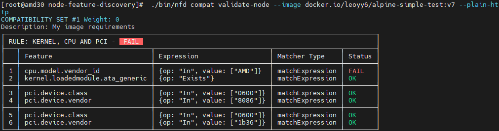

# NodeFeatureGroup Rule Specification

## Overview

This document describes the NodeFeatureGroup (NFG) rule specification and matching logic used by the Image Compatibility Scheduler plugin. NFG rules define feature-based node selection criteria for container image compatibility.

## NodeFeatureGroup Structure

The NodeFeatureGroup CRD is defined as follows:

```go
// NodeFeatureGroup resource holds Node pools by featureGroup
// +kubebuilder:object:root=true
// +kubebuilder:resource:scope=Namespaced,shortName=nfg
// +kubebuilder:subresource:status
// +k8s:deepcopy-gen:interfaces=k8s.io/apimachinery/pkg/runtime.Object
// +genclient
type NodeFeatureGroup struct {
	metav1.TypeMeta   `json:",inline"`
	metav1.ObjectMeta `json:"metadata,omitempty"`

	// Spec defines the rules to be evaluated.
	Spec NodeFeatureGroupSpec `json:"spec"`

	// Status of the NodeFeatureGroup after the most recent evaluation of the
	// specification.
	Status NodeFeatureGroupStatus `json:"status,omitempty"`
}

// NodeFeatureGroupSpec describes a NodeFeatureGroup object.
type NodeFeatureGroupSpec struct {
	// List of rules to evaluate to determine nodes that belong in this group.
	Rules []GroupRule `json:"featureGroupRules"`
}

// GroupRule defines a rule for nodegroup filtering.
type GroupRule struct {
	// Name of the rule.
	Name string `json:"name"`

	// Vars is the variables to store if the rule matches. Variables can be
	// referenced from other rules enabling more complex rule hierarchies.
	// +optional
	Vars map[string]string `json:"vars"`

	// VarsTemplate specifies a template to expand for dynamically generating
	// multiple variables.
	// +optional
	VarsTemplate string `json:"varsTemplate"`

	// MatchFeatures specifies a set of matcher terms all of which must match.
	// +optional
	MatchFeatures FeatureMatcher `json:"matchFeatures"`

	// MatchAny specifies a list of matchers one of which must match.
	// +optional
	MatchAny []MatchAnyElem `json:"matchAny"`
}
```

## Rule Matching Logic

### Logical Operators

The rule matching follows these logical relationships:

1. **Between GroupRules**: Multiple `GroupRule` entries have an **OR** relationship
2. **Within a GroupRule**: `MatchFeatures` and `MatchAny` have an **AND** relationship
3. **Within MatchFeatures**: All feature matchers have an **AND** relationship
4. **Within MatchAny**: Individual matchers have an **OR** relationship

The final match status is calculated as:
```go
matchStatus.IsMatch = (len(r.MatchAny) == 0 || isMatchAny) && (len(r.MatchFeatures) == 0 || isMatchFeature)
```

### Execution Flow

The rule execution process in NFD (Node Feature Discovery) follows this pattern:

```go
// Execute rules and create matching groups
nodePool := make([]nfdv1alpha1.FeatureGroupNode, 0)
nodeGroupValidator := make(map[string]bool)
for _, features := range nodeFeaturesList {
	for _, rule := range nodeFeatureGroup.Spec.Rules {
		ruleOut, err := nodefeaturerule.ExecuteGroupRule(&rule, features, true)
		if err != nil {
			klog.ErrorS(err, "failed to evaluate rule", "ruleName", rule.Name)
			continue
		}

		if ruleOut.MatchStatus.IsMatch {
			system := features.Attributes["system.name"]
			nodeName := system.Elements["nodename"]
			if _, ok := nodeGroupValidator[nodeName]; !ok {
				nodePool = append(nodePool, nfdv1alpha1.FeatureGroupNode{
					Name: nodeName,
				})
				nodeGroupValidator[nodeName] = true
			}
		}

		// Feed back vars from rule output to features map for subsequent rules to match
		features.InsertAttributeFeatures(nfdv1alpha1.RuleBackrefDomain, nfdv1alpha1.RuleBackrefFeature, ruleOut.Vars)
	}
}

// Update the NodeFeatureGroup object with the updated featureGroupRules
nodeFeatureGroupUpdated := nodeFeatureGroup.DeepCopy()
nodeFeatureGroupUpdated.Status.Nodes = nodePool
```

## Example Rule Analysis

### Single Rule Example

Consider this rule from `compatibility-artifact-kernel-pci.yaml`:

```yaml
Spec:
  featureGroupRules:
  - matchAny:
    - matchFeatures:
      - feature: pci.device
        matchExpressions:
          vendor: {op: In, value: ["8086"]}
          class: {op: In, value: ["0600"]}
    - matchFeatures:
      - feature: pci.device
        matchExpressions:
          vendor: {op: In, value: ["1b36"]}
          class: {op: In, value: ["0600"]}
    matchFeatures:
    - feature: kernel.loadedmodule
      matchExpressions:
        ip_tables: {op: Exists}
    - feature: cpu.model
      matchExpressions:
        vendor_id: {op: In, value: ["Intel"]}
    name: "kernel, cpu and pci"
    
```

**Interpretation:**
1. The rule requires **both** conditions to be satisfied:
   - **MatchAny section**: At least one PCI device condition must match
     - Option 1: PCI device with vendor 8086 AND class 0600
     - Option 2: PCI device with vendor 1b36 AND class 0600
   - **MatchFeatures section**: Both kernel and CPU conditions must match
     - Kernel: `ip_tables` module must be loaded
     - CPU: Vendor must be Intel

2. If the final `MatchFeatures` section fails (e.g., Intel CPU not found), the entire rule fails
#### NFD Client Matching

The NFD client evaluates compatibility rules and produces results similar to:

### Multiple Rules Example

When multiple GroupRules are defined, satisfying any single rule is sufficient:

```yaml
version: v1alpha1
compatibilities:
- description: "My image requirements"
  rules:
  - name: "kernel, cpu"
    matchFeatures:
    - feature: kernel.loadedmodule
      matchExpressions:
        ip_tables: {op: Exists}
    - feature: cpu.model
      matchExpressions:
        vendor_id: {op: In, value: ["AMD"]}
  - name: "pci"
    matchAny:
    - matchFeatures:
      - feature: pci.device
        matchExpressions:
          vendor: {op: In, value: ["8086"]}
          class: {op: In, value: ["0600"]}
    - matchFeatures:
      - feature: pci.device
        matchExpressions:
          vendor: {op: In, value: ["1b36"]}
          class: {op: In, value: ["0600"]}
```

**Equivalent NFG representation:**
```yaml
Spec:
  featureGroupRules:
  - matchAny:
    - matchFeatures:
      - feature: pci.device
        matchExpressions:
          vendor: {op: In, value: ["8086"]}
          class: {op: In, value: ["0600"]}
    - matchFeatures:
      - feature: pci.device
        matchExpressions:
          vendor: {op: In, value: ["1b36"]}
          class: {op: In, value: ["0600"]}
    name: "pci"
  - matchFeatures:
    - feature: kernel.loadedmodule
      matchExpressions:
        ip_tables: {op: Exists}
    - feature: cpu.model
      matchExpressions:
        vendor_id: {op: In, value: ["AMD"]}
    name: "kernel, cpu"
```
