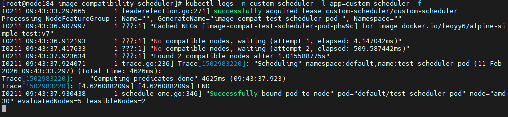
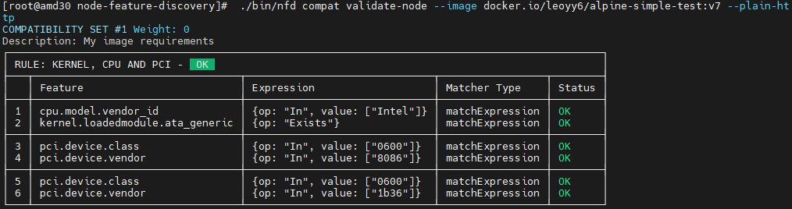
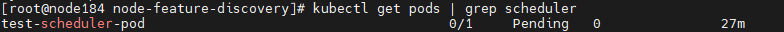
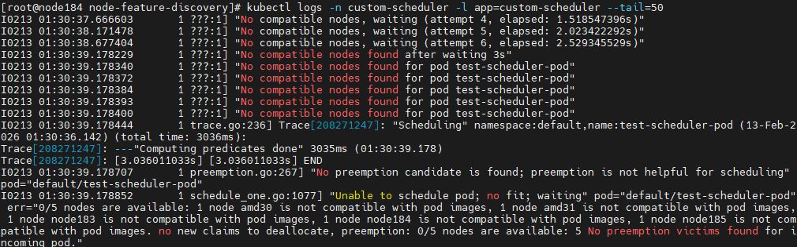
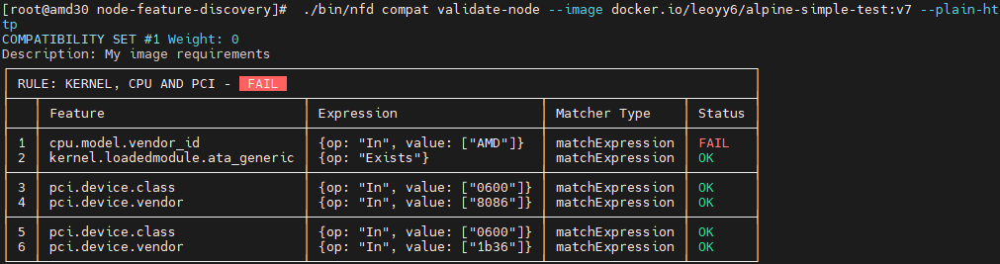

# Image Compatibility Scheduler Verification Guide

## Overview

The Image Compatibility Scheduler extends Kubernetes scheduling by leveraging the [NFD Image Compatibility feature](https://kubernetes-sigs.github.io/node-feature-discovery/v0.18/usage/image-compatibility.html#image-compatibility). It allows you to define custom container requirements (e.g., kernel modules, CPU models, PCI devices) and ensures pods are scheduled only onto nodes that satisfy those requirements.

This guide walks through the end‑to‑end verification of the scheduler, from deployment to observing the scheduling result.

## Prerequisites

- A running Kubernetes cluster (v1.24+)
- `kubectl` configured to access the cluster
- `make` and Docker (for building the scheduler image)
- [ORAS CLI](https://github.com/oras-project/oras) (optional, for attaching compatibility artifacts)

## Step 1 – Deploy the Scheduler

Build the custom scheduler image and deploy it to your cluster.

```bash
# Build the image and apply all Kubernetes manifests
make deploy

# Verify the scheduler pod is running
kubectl get pods -n custom-scheduler

# Check the scheduler logs
kubectl logs -n custom-scheduler -l app=custom-scheduler
```

Expected output: a pod named `custom-scheduler-*` in `Running` state.

## Step 2 – Define Compatibility Requirements

Container images can carry compatibility metadata that describes the node features they require. The metadata is a YAML specification following the NFD image‑compatibility schema.

### Example Specification

Save the following as `compatibility-artifact-kernel-pci.yaml`:

```yaml
version: v1alpha1
compatibilities:
- description: "My image requirements"
  rules:
  - name: "kernel, cpu and pci"
    matchFeatures:
    - feature: kernel.loadedmodule
      matchExpressions:
        ata_generic: {op: Exists}
    - feature: cpu.model
      matchExpressions:
        vendor_id: {op: In, value: ["Intel"]}
    matchAny:
    - matchFeatures:
      - feature: pci.device
        matchExpressions:
          vendor: {op: In, value: ["8086"]}
          class: {op: In, value: ["0600"]}
    - matchFeatures:
      - feature: pci.device
        matchExpressions:
          vendor: {op: In, value: ["1b36"]}
          class: {op: In, value: ["0600"]}
```

This specification requires:
- The `ata_generic` kernel module to be loaded
- CPU vendor to be Intel
- A PCI device with vendor `8086` and class `0600` **or** vendor `1b36` and class `0600`

## Step 3 – Attach the Specification to an Image (Optional)

If you want to test with a real container image, you can attach the compatibility artifact using ORAS.

```bash
oras attach --artifact-type application/vnd.nfd.image-compatibility.v1alpha1 \
  <your-image-url> \
  compatibility-artifact-kernel-pci.yaml:application/vnd.nfd.image-compatibility.spec.v1alpha1+yaml
```

For local testing, you can skip this step and use the scheduler’s built‑in artifact client that reads from a ConfigMap.

## Step 4 – Deploy a Test Pod

Create a Pod that uses the custom scheduler and references the image with compatibility requirements.

Example pod manifest (`test-pod.yaml`):

```yaml
apiVersion: v1
kind: Pod
metadata:
  name: test-scheduler-pod
spec:
  schedulerName: custom-scheduler
  containers:
  - name: app
    image: <your-image>   # or any image that has the attached artifact
    imagePullPolicy: IfNotPresent
```

Apply the pod:

```bash
kubectl apply -f test-pod.yaml
```

## Step 5 – Verify Scheduling Outcome

### Check Pod Scheduling

```bash
kubectl get pod test-scheduler-pod -o wide
```

Look for the `NODE` column – the pod should be scheduled onto a node that satisfies the compatibility rules.

**Example – Successful scheduling**
The following screenshot shows a pod that has been scheduled to a compatible node (`amd31`):


### Inspect Created NodeFeatureGroup Resources

The scheduler creates temporary `NodeFeatureGroup` (NFG) custom resources to represent the compatibility rules. List them:

```bash
kubectl get nodefeaturegroups.nfd.k8s-sigs.io -A
```

You should see an NFG with a name like `image-compat-test-pod-*`. Describe it to see the rules and the matched nodes:

```bash
kubectl describe nodefeaturegroup <nfg-name>
```

**Example – NodeFeatureGroup content**
The details of created NodeFeatureGroup, including its rules and the nodes that match those rules(`amd30`, `amd31`):


### View Scheduler Logs

Examine the scheduler logs for details about compatibility evaluation and NFG creation:

```bash
kubectl logs -n custom-scheduler -l app=custom-scheduler --tail=50
```

Some issues remain:
- The update of NFG relies on the NFD master’s periodic resync, which may cause delays in scheduling decisions.
  - Have added a retry mechanism to handle this, with a default retry interval of 3 seconds.
  - This issue will occur in pre-group solution.

### View NFD Client results
Use the NFD client to check the compatibility nodes with the rules matching results:

```bash
./bin/nfd compat validate-node --image docker.io/leoyy6/alpine-simple-test:v7 --plain-http
```


## Step 6 – Test Incompatibility Scenario
To verify that the scheduler correctly handles incompatibility, create a specification that requires features not present on any node. For example, change the CPU vendor to `AMD` in the compatibility spec.
```bash
# attach compatibility artifact to test image
oras attach --insecure --artifact-type application/vnd.nfd.image-compatibility.v1alpha1 \
  docker.io/leoyy6/alpine-simple-test:v7 \
  scripts/incompatibility-artifact-kernel-pci.yaml:application/vnd.nfd.image-compatibility.spec.v1alpha1+yaml

# deploy test-pod
kubectl apply -f scripts/test-pod.yaml
```
The pod should remain in `Pending` state, and the scheduler logs should indicate that no compatible nodes were found.



Use the NFD client to check the nodes with the rules matching results:

## Step 6 – Cleanup

Remove the test pod and the scheduler deployment when finished.

```bash
kubectl delete pod test-scheduler-pod
make undeploy   # if you want to remove the scheduler entirely
```


## Conclusion

By following this verification guide, you have validated that the Image Compatibility Scheduler correctly:

1. Deploys and runs in your cluster.
2. Reads compatibility requirements from an artifact.
3. Creates temporary NodeFeatureGroup CRs that mirror those requirements.
4. Schedules pods only onto nodes that satisfy the compatibility rules.

For further details, refer to the [NFD Image Compatibility documentation](https://kubernetes-sigs.github.io/node-feature-discovery/v0.18/usage/image-compatibility.html) and the project’s [README](../README.md).